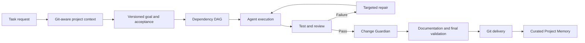

# Orqalis

### From an engineering task to a reviewed Git change.

Orqalis coordinates specialized agents around an explicit goal, a dependency-aware plan,
persistent project memory and evidence-backed acceptance. Follow every step in local
Mission Control—from the first task through review, targeted repair and delivery.

**Python 3.12+** · **React + TypeScript** · **MCP** · **MIT** · **Runs locally**


*Actual application capture from a persisted local integration run. Documentation examples
use deterministic test providers; they exercise the real Core rather than mocked UI data.*

[User guide](GUIDE.md) · [Dashboard tour](docs/DASHBOARD.md) ·
[Architecture](docs/01-system-architecture.md) · [Publishing](docs/PUBLISHING.md)

## Why Orqalis?

An agent can edit a file. Shipping a change also requires context, a clear contract,
verification, recovery and a reviewable Git history.

Orqalis makes those steps explicit:

- **Know the project.** Retrieve durable memory, validate Git freshness, then inspect gaps.
- **Keep the contract.** Versioned goals and acceptance criteria survive retries.
- **Coordinate the work.** One Orchestrator controls persisted transitions; agents perform scoped tasks.
- **Prove the result.** Tests, source checks and structured evidence determine acceptance.
- **Repair precisely.** Failed review creates targeted repair work within a configured limit.
- **Deliver deliberately.** An independent Change Guardian and final validation gate documentation and Git delivery.

## Quick start

From a checkout of this repository, install **Python 3.12+**, **uv**, **Node.js 24**,
**Git** and **Docker**. Compose provides local PostgreSQL with pgvector.

```sh
npm ci --prefix web
npm run build --prefix web
uv sync --frozen
docker compose up -d --wait
uv run orqalis migrate
uv run orqalis doctor
uv run orqalis ui --open
```

Open **http://localhost:7842**. On Windows, use npm.cmd if PowerShell blocks npm.ps1.

Register a committed project:

```sh
uv run orqalis init --repo /absolute/path/to/project
```

Configure a provider/model using the [provider setup guide](GUIDE.md#2-configuration-and-providers),
then start requirements discovery:

```sh
uv run orqalis run "Normalize names consistently" --repo /absolute/path/to/project --branch feature/normalize-names --open
```

This prepares context and a versioned goal; implementation requires an explicit execution
policy. Without a configured provider, the run records the failure and the command returns
provider_error. For provider-free goal preparation, supply an explicit --contract JSON file.
Review the goal and policy using the [first-task walkthrough](GUIDE.md#4-first-task-walkthrough).

**Prefer npm installation?** A tested launcher is prepared for
`npm install -g orqalis`. Public registry publication is pending. You can install the
locally built tarball with `npm install -g ./dist/orqalis-1.0.0.tgz`; it requires
Node.js 22+ and Python 3.12+. See [release preparation](docs/PUBLISHING.md).
The Python wheel includes the built UI and can also be installed directly.

## How it works



The browser, CLI, SDK and MCP clients all call the same Core. None owns a second workflow.
Elapsed time, progress, task status and usage come from persisted records.

## Mission Control

The run screen puts the goal, branch, phase and execution graph together. Inspect a node
to see its owner, task history, dependencies, context references, skills, tools, artifacts,
evidence and errors. Keyboard selectors and task/actor lists provide alternatives to
graph interaction; mobile inspectors become sheets.

| View | What it answers |
| --- | --- |
| Mission / Graph | Who is working, what depends on what, and what is ready next? |
| Tasks / Agents | What is assigned, queued, blocked or complete? Who owns each attempt? |
| Timeline / Activity | Where did the time go? What happened, in persisted sequence order? |
| Acceptance | Which criteria pass or fail, with what evidence and repair history? |
| Project Brain | What knowledge was retrieved, where did it come from, and is it fresh? |
| Skills | Which capabilities are available or loaded, by whom and when? |
| Delivery / Metrics | Which files changed, did the gates pass, and what usage was reported? |


[Agent inspector](docs/assets/agent-inspector.jpg) ·
[Execution timeline](docs/assets/execution-timeline.jpg) ·
[Project Memory](docs/assets/project-memory.jpg) · [Skills](docs/assets/skills.jpg) ·
[Verification and repair](docs/assets/verification-repair.jpg) ·
[Repository delivery](docs/assets/repository-delivery.jpg)

The [dashboard tour](docs/DASHBOARD.md) explains each view, attribution limits,
event windows and screenshot provenance. Unknown metrics remain unknown.
Private model reasoning is never a dashboard feature.

## Agents, skills and memory

**Agents are roles; skills are capabilities; tools execute; providers supply the backend.**
Skills are discovered from trusted metadata and loaded for a task within its permission
profile. The dashboard reports observed loads, not an invented acquisition animation.

Project Memory retains architecture facts, repository knowledge, conventions, decisions,
known issues and curated run knowledge with source files, commits and verification state.
Unchanged Git HEAD avoids another broad scan; changed committed files refresh selectively.

```sh
uv run orqalis status --repo /absolute/path/to/project --json
uv run orqalis memory status --repo /absolute/path/to/project
uv run orqalis capabilities
uv run orqalis runs --help
```

## Verification, repair and Git safety

Acceptance is a contract, not an agent's opinion. Deterministic checks and structured
review evidence drive PASS/FAIL. Repairs retain the original goal and previous evidence;
exhausted repair budgets move to human review.

Execution uses isolated Git worktrees and explicit write/command policies. Final delivery
checks the accepted tree after documentation, records a detailed commit, and pushes only
when both project and delivery policy permit it. There is no force-push workflow.

See [execution policies](GUIDE.md#6-execution-and-delivery-policies) and
[operations and recovery](docs/OPERATIONS.md).

## Configuration and integrations

| Concern | Configuration |
| --- | --- |
| Database | ORQALIS_DATABASE_URL; PostgreSQL with pgvector |
| OpenAI | ORQALIS_OPENAI_API_KEY and an explicit ORQALIS_OPENAI_MODEL |
| Anthropic | ORQALIS_ANTHROPIC_API_KEY and an explicit ORQALIS_ANTHROPIC_MODEL |
| Trusted skills | ORQALIS_SKILL_ROOTS, a JSON array of trusted directories |
| Local interface | ORQALIS_HOST / ORQALIS_PORT; loopback access only |
| Execution | Explicit write scope, allowed commands and sandbox policy |

Model credentials are unnecessary for browsing persisted runs or using structured memory.
Model-backed requirements, implementation and independent review need a configured provider.
Repository .env files are not loaded automatically. Never commit credentials.

Codex, Claude Code, GitHub Copilot and other compatible assistants can use the
[project-scoped MCP interface](docs/MCP.md). The Python SDK, REST API and WebSocket feed
expose the same services. See the [configuration guide](GUIDE.md#2-configuration-and-providers)
and [integration examples](docs/examples/).

## Architecture and roadmap

Core uses Python, Pydantic, SQLAlchemy, PostgreSQL/pgvector and durable execution records.
FastAPI hosts the loopback API/event stream; React, React Flow and TypeScript provide
Mission Control. Provider integrations share one contract.

- [Canonical architecture](docs/01-system-architecture.md)
- [Original source-of-truth index](docs/SOURCE_OF_TRUTH.md) and [sign-off](SIGNOFF.md)
- [Implementation status](docs/IMPLEMENTATION_STATUS.md)
- [Roadmap](docs/08-features-and-roadmap.md)
- [Release scope and limitations](docs/RELEASE_NOTES.md)

Optional richer memory semantics, large-run projection optimization and external host
adapters remain follow-up work. Current boundaries are documented rather than hidden.

## Contributing

Start with [developer setup](docs/DEVELOPMENT.md). Keep changes incremental, preserve
workflow/acceptance invariants, add relevant tests and inspect the Git diff. Run the
backend, frontend and browser checks documented there before submitting a change.

## License

[MIT](LICENSE). Third-party dependencies retain their own licenses; frontend license
notices are included in release builds.
